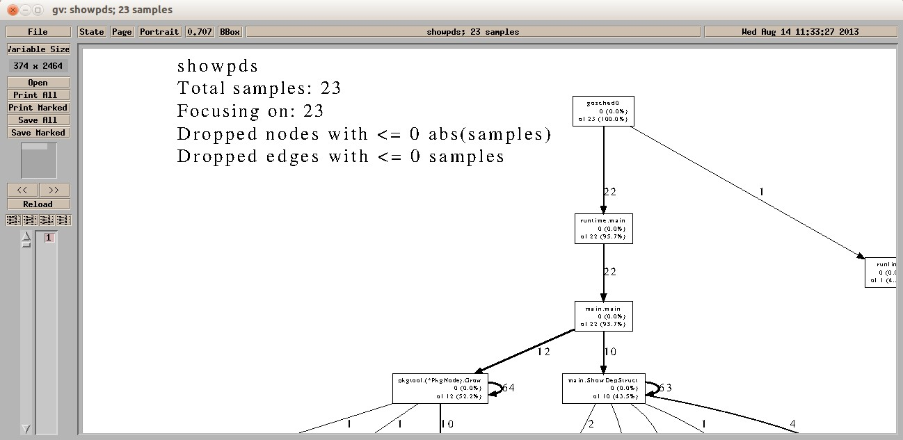
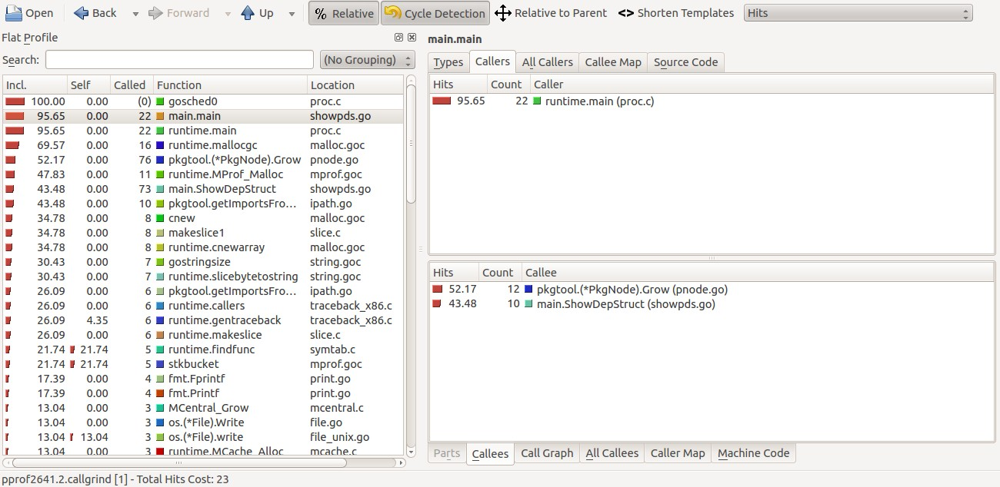

# go tool pprof

我们可以使用```go tool pprof```命令来交互式的访问概要文件的内容。命令将会分析指定的概要文件，并会根据我们的要求为我们提供高可读性的输出信息。

在Go语言中，我们可以通过标准库的代码包```runtime```和```runtime/pprof```中的程序来生成三种包含实时性数据的概要文件，分别是CPU概要文件、内存概要文件和程序阻塞概要文件。下面我们先来分别介绍用于生成这三种概要文件的API的用法。

**CPU概要文件**

在介绍CPU概要文件的生成方法之前，我们先来简单了解一下CPU主频。CPU的主频，即CPU内核工作的时钟频率（CPU Clock Speed）。CPU的主频的基本单位是赫兹（Hz），但更多的是以兆赫兹（MHz）或吉赫兹（GHz）为单位。时钟频率的倒数即为时钟周期。时钟周期的基本单位为秒（s），但更多的是以毫秒（ms）、微妙（us）或纳秒（ns）为单位。在一个时钟周期内，CPU执行一条运算指令。也就是说，在1000 Hz的CPU主频下，每1毫秒可以执行一条CPU运算指令。在1 MHz的CPU主频下，每1微妙可以执行一条CPU运算指令。而在1 GHz的CPU主频下，每1纳秒可以执行一条CPU运算指令。

在默认情况下，Go语言的运行时系统会以100 Hz的的频率对CPU使用情况进行取样。也就是说每秒取样100次，即每10毫秒会取样一次。为什么使用这个频率呢？因为100 Hz既足够产生有用的数据，又不至于让系统产生停顿。并且100这个数上也很容易做换算，比如把总取样计数换算为每秒的取样数。实际上，这里所说的对CPU使用情况的取样就是对当前的Goroutine的堆栈上的程序计数器的取样。由此，我们就可以从样本记录中分析出哪些代码是计算时间最长或者说最耗CPU资源的部分了。我们可以通过以下代码启动对CPU使用情况的记录。

	func startCPUProfile() {
		if *cpuProfile != "" {
			f, err := os.Create(*cpuProfile)
			if err != nil {
				fmt.Fprintf(os.Stderr, "Can not create cpu profile output file: %s",
					err)
				return
			}
			if err := pprof.StartCPUProfile(f); err != nil {
				fmt.Fprintf(os.Stderr, "Can not start cpu profile: %s", err)
				f.Close()
				return
			}
		}
	}

在函数```startCPUProfile```中，我们首先创建了一个用于存放CPU使用情况记录的文件。这个文件就是CPU概要文件，其绝对路径由```*cpuProfile```的值表示。然后，我们把这个文件的实例作为参数传入到函数```pprof.StartCPUProfile```中。如果此函数没有返回错误，就说明记录操作已经开始。需要注意的是，只有CPU概要文件的绝对路径有效时此函数才会开启记录操作。

如果我们想要在某一时刻停止CPU使用情况记录操作，就需要调用下面这个函数：

	func stopCPUProfile() {
		if *cpuProfile != "" {
			pprof.StopCPUProfile() // 把记录的概要信息写到已指定的文件
		}
	}

在这个函数中，并没有代码用于CPU概要文件写入操作。实际上，在启动CPU使用情况记录操作之后，运行时系统就会以每秒100次的频率将取样数据写入到CPU概要文件中。```pprof.StopCPUProfile```函数通过把CPU使用情况取样的频率设置为0来停止取样操作。并且，只有当所有CPU使用情况记录都被写入到CPU概要文件之后，```pprof.StopCPUProfile```函数才会退出。从而保证了CPU概要文件的完整性。

**内存概要文件**

内存概要文件用于保存在用户程序执行期间的内存使用情况。这里所说的内存使用情况，其实就是程序运行过程中堆内存的分配情况。Go语言运行时系统会对用户程序运行期间的所有的堆内存分配进行记录。不论在取样的那一时刻、堆内存已用字节数是否有增长，只要有字节被分配且数量足够，分析器就会对其进行取样。开启内存使用情况记录的方式如下：

	func startMemProfile() {
		if *memProfile != "" && *memProfileRate > 0 {
			runtime.MemProfileRate = *memProfileRate
		}
	}

我们可以看到，开启内存使用情况记录的方式非常简单。在函数```startMemProfile```中，只有在```*memProfile```和```*memProfileRate```的值有效时才会进行后续操作。```*memProfile```的含义是内存概要文件的绝对路径。```*memProfileRate```的含义是分析器的取样间隔，单位是字节。当我们将这个值赋给int类型的变量```runtime.MemProfileRate```时，就意味着分析器将会在每分配指定的字节数量后对内存使用情况进行取样。实际上，即使我们不给```runtime.MemProfileRate```变量赋值，内存使用情况的取样操作也会照样进行。此取样操作会从用户程序开始时启动，且一直持续进行到用户程序结束。```runtime.MemProfileRate```变量的默认值是```512 * 1024```，即512K个字节。只有当我们显式的将```0```赋给```runtime.MemProfileRate```变量之后，才会取消取样操作。

在默认情况下，内存使用情况的取样数据只会被保存在运行时内存中，而保存到文件的操作只能由我们自己来完成。请看如下代码：

	func stopMemProfile() {
		if *memProfile != "" {
			f, err := os.Create(*memProfile)
			if err != nil {
				fmt.Fprintf(os.Stderr, "Can not create mem profile output file: %s", err)
				return
			}
			if err = pprof.WriteHeapProfile(f); err != nil {
				fmt.Fprintf(os.Stderr, "Can not write %s: %s", *memProfile, err)
			}
			f.Close()
		}
	}

从函数名称上看，```stopMemProfile```函数的功能是停止对内存使用情况的取样操作。但是，它只做了将取样数据保存到内存概要文件的操作。在```stopMemProfile```函数中，我们调用了函数```pprof.WriteHeapProfile```，并把代表内存概要文件的文件实例作为了参数。如果```pprof.WriteHeapProfile```函数没有返回错误，就说明数据已被写入到了内存概要文件中。

需要注意的是，对内存使用情况进行取样的程序会假定取样间隔在用户程序的运行期间内都是一成不变的，并且等于```runtime.MemProfileRate```变量的当前值。因此，我们应该在我们的程序中只改变内存取样间隔一次，且应尽早改变。比如，在命令源码文件的main函数的开始处就改变它。

**程序阻塞概要文件**

程序阻塞概要文件用于保存用户程序中的Goroutine阻塞事件的记录。我们来看开启这项操作的方法：

	func startBlockProfile() {
		if *blockProfile != "" && *blockProfileRate > 0 {
			runtime.SetBlockProfileRate(*blockProfileRate)
		}
	}

与开启内存使用情况记录的方式类似，在函数```startBlockProfile```中，当```*blockProfile```和```*blockProfileRate```的值有效时，我们会设置对Goroutine阻塞事件的取样间隔。```*blockProfile```的含义为程序阻塞概要文件的绝对路径。```*blockProfileRate```的含义是分析器的取样间隔，单位是次。函数```runtime.SetBlockProfileRate```的唯一参数是int类型的。它的含义是分析器会在每发生几次Goroutine阻塞事件时对这些事件进行取样。如果我们不显式的使用```runtime.SetBlockProfileRate```函数设置取样间隔，那么取样间隔就为1。也就是说，在默认情况下，每发生一次Goroutine阻塞事件，分析器就会取样一次。与内存使用情况记录一样，运行时系统对Goroutine阻塞事件的取样操作也会贯穿于用户程序的整个运行期。但是，如果我们通过```runtime.SetBlockProfileRate```函数将这个取样间隔设置为```0```或者负数，那么这个取样操作就会被取消。

我们在程序结束之前可以将被保存在运行时内存中的Goroutine阻塞事件记录存放到指定的文件中。代码如下：

	func stopBlockProfile() {
		if *blockProfile != "" && *blockProfileRate >= 0 {
			f, err := os.Create(*blockProfile)
			if err != nil {
				fmt.Fprintf(os.Stderr, "Can not create block profile output file: %s", err)
				return
			}
			if err = pprof.Lookup("block").WriteTo(f, 0); err != nil {
				fmt.Fprintf(os.Stderr, "Can not write %s: %s", *blockProfile, err)
			}
			f.Close()
		}
	}

在创建程序阻塞概要文件之后，```stopBlockProfile```函数会先通过函数```pprof.Lookup```将保存在运行时内存中的内存使用情况记录取出，并在记录的实例上调用```WriteTo```方法将记录写入到文件中。

**更多的概要文件**

我们可以通过```pprof.Lookup```函数取出更多种类的取样记录。如下表：

_表0-20 可从pprof.Lookup函数中取出的记录_
<table>
   <tr>
    <th width=60px>
	  名称
	</th>
	<th width=180px>
	  说明
	</th>
    <th width=100px>
	  取样频率
	</th>
  </tr>
  <tr>
    <td>
	  goroutine
	</td>
	<td>
	  活跃Goroutine的信息的记录。
	</td>
    <td>
	  仅在获取时取样一次。
	</td>
  </tr>
  <tr>
    <td>
	  threadcreate
	</td>
	<td>
	  系统线程创建情况的记录。
	</td>
    <td>
	  仅在获取时取样一次。
	</td>
  </tr>
  <tr>
    <td>
	  heap
	</td>
	<td>
	  堆内存分配情况的记录。
	</td>
    <td>
	  默认每分配512K字节时取样一次。
	</td>
  </tr>
  <tr>
    <td>
	  block
	</td>
	<td>
	  Goroutine阻塞事件的记录。
	</td>
    <td>
	  默认每发生一次阻塞事件时取样一次。
	</td>
  </tr>
</table>

在上表中，前两种记录均为一次取样的记录，具有即时性。而后两种记录均为多次取样的记录，具有实时性。实际上，后两种记录“heap”和“block”正是我们前面讲到的内存使用情况记录和程序阻塞情况记录。

我们知道，在用户程序运行期间各种状态是在不断变化的。尤其对于后两种记录来说，随着取样次数的增多，记录项的数量也会不断增长。而对于前两种记录“goroutine”和“threadcreate”来说，如果有新的活跃Goroutine产生或新的系统线程被创建，其记录项数量也会增大。所以，Go语言的运行时系统在从内存中获取记录时都会先预估一个记录项数量。如果在从预估记录项数量到获取记录之间的时间里又有新记录项产生，那么运行时系统会试图重新获取全部记录项。另外，运行时系统使用切片来装载所有记录项的。如果当前使用的切片装不下所有记录项，运行时系统会根据当前记录项总数创建一个更大的切片，并再次试图装载所有记录项。直到这个切片足以装载所有的记录项为止。但是，如果记录项增长过快的话，运行时系统将不得不不断的进行尝试。这可能导致过多的时间消耗。对于前两种记录“goroutine”和“threadcreate”来说，运行时系统创建的切片的大小为当前记录项总数再加10。对于前两种记录“heap”和“block”来说，运行时系统创建的切片的大小为当前记录项总数再加50。虽然上述情况发生的概率可能并不会太高，但是如果我们在对某些高并发的用户程序获取上述记录的时候耗费的时间过长，可以先排查一下这类原因。实际上，我们在前面介绍的这几
种记录操作更适合用于对高并发的用户程序进行状态检测。

我们可以通过下面这个函数分别将四种记录输出到文件。

	func SaveProfile(workDir string, profileName string, ptype ProfileType, debug int) {
		absWorkDir := getAbsFilePath(workDir)
		if profileName == "" {
			profileName = string(ptype)
		}
		profilePath := filepath.Join(absWorkDir, profileName)
		f, err := os.Create(profilePath)
		if err != nil {
			fmt.Fprintf(os.Stderr, "Can not create profile output file: %s", err)
			return
		}
		if err = pprof.Lookup(string(ptype)).WriteTo(f, debug); err != nil {
			fmt.Fprintf(os.Stderr, "Can not write %s: %s", profilePath, err)
		}
		f.Close()
	}

函数```SaveProfile```有四个参数。第一个参数是概要文件的存放目录。第二个参数是概要文件的名称。第三个参数是概要文件的类型。其中，类型```ProfileType```只是为string类型起的一个别名而已。这样是为了对它的值进行限制。它的值必须为“goroutine”、“threadcreate”、“heap”或“block”中的一个。我们现在来重点说一下第四个参数。参数```debug```控制着概要文件中信息的详细程度。这个参数也就是传给结构体```pprof.Profile```的指针方法```WriteTo```的第二个参数。而```pprof.Profile```结构体的实例的指针由函数```pprof.Lookup```产生。下面我们看看参数debug的值与写入概要文件的记录项内容的关系。

_表0-21 参数debug对概要文件内容的影响_
<table class="table table-bordered table-striped table-condensed">
   <tr>
    <th width=100px>
	  记录\debug
	</th>
	<th width=120px>
	  小于等于0
	</th>
    <th width=120px>
	  等于1
	</th>
    <th width=120px>
	  大于等于2
	</th>
  </tr>
  <tr>
    <td>
	  goroutine
	</td>
	<td>
	  为每个记录项提供调用栈中各项的以十六进制表示的内存地址。
	</td>
    <td>
	  在左边提供的信息的基础上，为每个记录项的调用栈中各项提供与内存地址对应的带代码包导入路径的函数名和源码文件路径及源码所在行号。
	</td>
    <td>
	  以高可读的方式提供各活跃Goroutine的状态信息和调用栈信息。
	</td>
  </tr>
  <tr>
    <td>
	  threadcreate
	</td>
	<td>
	  同上。
	</td>
    <td>
	  同上。
	</td>
    <td>
	  同左。
    </td>
  </tr>
  <tr>
    <td>
	  heap
	</td>
	<td>
	  同上。
	</td>
    <td>
	  在左边提供的信息的基础上，为每个记录项的调用栈中各项提供与内存地址对应的带代码包导入路径的函数名和源码文件路径及源码所在行，并提供内存状态信息。
	</td>
    <td>
	  同左。
    </td>
  </tr>
  <tr>
    <td>
	  block
	</td>
	<td>
	  同上。
	</td>
    <td>
	  在左边提供的信息的基础上，为每个记录项的调用栈中各项提供与内存地址对应的带代码包导入路径的函数名和源码文件路径及源码所在行号。
	</td>
    <td>
	  同左。
    </td>
  </tr>
</table>

从上表可知，当```debug```的值小于等于```0```时，运行时系统仅会将每个记录项中的基本信息写入到概要文件中。记录项的基本信息只包括其调用栈中各项的以十六进制表示的内存地址。```debug```的值越大，我们能从概要文件中获取的信息越多。但是，```go tool pprof```命令会无视那些除基本信息以外的附加信息。实际上，运行时系统在向概要文件中写入附加信息时会在最左边加入“#”，以表示当前行为注释行。也正因为有了这个前缀，```go tool pprof```命令才会略过对这些附加信息的解析。这其中有一个例外，那就是当```debug```大于等于```2```时，Goroutine记录并不是在基本信息的基础上附加信息，而是完全以高可读的方式写入各活跃Goroutine的状态信息和调用栈信息。并且，在所有行的最左边都没有前缀“#”。显然，这个概要文件是无法被```go tool pprof```命令解析的。但是它对于我们来说会更加直观和有用。

至此，我们已经介绍了使用标准库代码包```runtime```和```runtime/pprof```中的程序生成概要文件的全部方法。在上面示例中的所有代码都被保存在goc2p项目的代码包```basic/prof```中。代码包```basic/prof```中的这些程序非常易于使用。不过由于Go语言目前没有类似停机钩子（Shutdown Hook）的API（应用程序接口），所以代码包```basic/prof```中的程序目前只能以侵入式的方式被使用。

**pprof工具**

我们在上一小节中提到过，任何以```go tool```开头的Go命令内部指向的特殊工具都被保存在目录$GOROOT/pkg/tool/$GOOS_$GOARCH/中。我们把这个目录叫做Go工具目录。与其他特殊工具不同的是，pprof工具并不是用Go语言编写的，而是由Perl语言编写的。（Perl是一种通用的、动态的解释型编程语言）与Go语言不同，Perl语言可以直接读取源码并运行。正因为如此，```pprof```工具的源码文件被直接保存在了Go工具目录下。而对于其它Go工具，存在此目录的都是经过编译而生成的可执行文件。我们可以直接用任意一种文本查看工具打开在Go工具目录下的pprof工具的源码文件pprof。实际上，这个源码文件拷贝自Google公司发起的开源项目gperftools。此项目中包含了很多有用的工具。这些工具可以帮助开发者创建更健壮的应用程序。pprof就是其中的一个非常有用的工具。

因为```pprof```工具是用Perl语言编写的，所以执行```go tool pprof```命令的前提条件是需要在当前环境下安装Perl语言，推荐的版本号是5.x。关于Perl语言的安装方法就不在这里叙述了，读者可以自己找到方法并自行安装它。在安装完Perl语言之后，我们可以在命令行终端中进入到Go工具目录，并执行命令```perl pprof```。它与我们在任意目录下执行```go tool pprof```命令的效果是一样的。当然，如果想要让```go tool pprof```命令在任意目录下都可以被执行，我们需要先设置好与Go语言相关的环境变量。

我们在本小节已经讨论过，```go tool pprof```命令会分析指定的概要文件并使得我们能够以交互式的方式访问其中的信息。但是光有概要文件还不够，我们还需要概要文件中信息的来源——命令源码文件的可执行文件。毕竟，概要文件中的信息是对在运行期间的用户程序取样的结果。而可以运行的Go语言程序只能是编译命令源码文件后生成的可执行文件。因此，为了演示```go tool pprof```命令的用法，我们还创建或改造一个命令源码文件。在我们的goc2p项目的代码包中有一个名称为showpds.go的命令源码文件。这个命令源码文件用来解析指定的代码包的依赖关系，并将这些依赖关系打印到标准输出设备上。选用这个命令源码文件的原因是，我们可以通过改变指定的代码包来控制这个命令源码文件的运行时间的长短。不同的代码包可能会有不同数量的直接依赖包和间接依赖包。依赖包越多的代码包会使这个命令源码文件耗费更多的时间来解析它的依赖关系。命令源码文件运行的时间越长，我们得到的概要文件中的信息就越有意义。为了生成概要文件，我们需要稍微的改造一下这个命令源码文件。首先我们需要在这个文件中导入代码包```basic/prof```。然后，我们需要在它的main函数的开头加入一行代码```prof.Start()```。这行代码的含义是检查相关标记，并在标记有效时开启或设置对应的使用情况记录操作。最后，我们还需要在main函数的defer代码块中加入一行代码```prof.Stop()```。这行代码的含义是，获取已开启的记录的取样数据并将它们写入到指定的概要文件中。通过这三个步骤，我们就已经把生成运行时概要文件的功能附加到这个命令源码文件中了。为了开启这些功能，我还需要在通过执行```go run```命令来运行这个命令源码文件的时候，加入相应的标记。对代码包```basic/prof```中的程序有效的标记如下表。

_表0-22 对代码包basic/prof的API有效的标记_
<table class="table table-bordered table-striped table-condensed">
   <tr>
    <th width=125px>
	  标记名称
	</th>
    <th>
	  标记描述
	</th>
  </tr>
  <tr>
    <td>
	  -cpuprofile
	</td>
	<td>
	  指定CPU概要文件的保存路径。该路径可以是相对路径也可以是绝对路径，但其父路径必须已存在。
	</td>
  </tr>
  <tr>
    <td>
	  -blockprofile
	</td>
	<td>
	   指定程序阻塞概要文件的保存路径。该路径可以是相对路径也可以是绝对路径，但其父路径必须已存在。
	</td>
  </tr>
  <tr>
    <td>
	  -blockprofilerate
	</td>
	<td>
	  定义其值为n。此标记指定每发生n次Goroutine阻塞事件时，进行一次取样操作。
	</td>
  </tr>
  <tr>
    <td>
	  -memprofile
	</td>
	<td>
	  指定内存概要文件的保存路径。该路径可以是相对路径也可以是绝对路径，但其父路径必须已存在。
	</td>
  </tr>
  <tr>
    <td>
	  -memprofilerate
	</td>
	<td>
	  定义其值为n。此标记指定每分配n个字节的堆内存时，进行一次取样操作。
	</td>
  </tr>
</table>

下面我们使用```go run```命令运行改造后的命令源码文件showpds.go。示例如下：

	hc@ubt:~/golang/goc2p$ mkdir pprof
	hc@ubt:~/golang/goc2p$ cd helper/pds
	hc@ubt:~/golang/goc2p/helper/pds$ go run showpds.go -p="runtime" cpuprofile="../../../pprof/cpu.out" -blockprofile="../../../pprof/block.out" -blockprofilerate=1 -memprofile="../../../pprof/mem.out" -memprofilerate=10
	The package node of 'runtime': {/usr/local/go/src/pkg/ runtime [] [] false}
	The dependency structure of package 'runtime':
	runtime->unsafe

在上面的示例中，我们使用了所有的对代码包```basic/prof```的API有效的标记。另外，标记```-p```是对命令源码文件showpds.go有效的。其含义是指定要解析依赖关系的代码包的导入路径。

现在我们来查看一下goc2p项目目录下的pprof子目录：

	hc@ubt:~/golang/goc2p/helper/pds$ ls ../../../pprof
	block.out  cpu.out  mem.out

这个目录中的三个文件分别对应了三种包含实时性数据的概要文件。这也证明了我们对命令源码文件showpds.go的改造是有效的。

好了，一切准备工作就绪。现在，我们就来看看```go tool pprof```命令都能做什么。首先，我们来编译命令源码文件showpds.go。

	hc@ubt:~/golang/goc2p/helper/pds$ go build showpds.go
	hc@ubt:~/golang/goc2p/helper/pds$ ls
	showpds showpds.go

然后，我们需要准备概要文件。标准库代码包```runtime```的依赖包极少，这使得可执行文件showpds在极短的时间内就会运行完毕。之前我们说过，程序运行的时间越长越好。所以我们需要找到一个直接和间接依赖包都很多的代码包。做过Web应用系统开发的同行们都知道，一个Web应用系统的后端程序可能会有很多的依赖，不论是代码库还是其他资源。根据我们的直觉，在Go语言的世界里也应该是在这样。在Go语言的标准库中，代码包```net/http```专门用来为Web应用系统开发提供各种API支持。我们就用这个代码包来生成所需的概要文件。

	hc@ubt:~/golang/goc2p/helper/pds$ ./showpds -p="net/http" -cpuprofile="../../../pprof/cpu.out" -blockprofile="../../../pprof/block.out" -blockprofilerate=1 -memprofile="../../../pprof/mem.out" -memprofilerate=10

标准库代码包```net/http```的依赖包很多。也正因为如此，我忽略了所有输出的内容。读者可以自己试试上面的这个命令。我们一口气生成了所有能够生成的概要文件作为备用。这写概要文件被保存在了goc2p项目的pprof目录中。如果在上面的命令被执行前还没有pprof目录，命令会报错。所以读者需要先创建这个目录。

现在我们就以可执行文件showpds和pprof目录下的CPU概要文件cpu.out作为参数来执行```go tool pprof```命令。实际上，我们通过```go tool pprof```命令进入的就是pprof工具的交互模式的界面。

	hc@ubt:~/golang/goc2p/helper/pds$ go tool pprof showpds ../../../pprof/cpu.out
	Welcome to pprof!  For help, type 'help'.
	(pprof)

我们可以在提示符“(pprof)”后面输入一些命令来查看概要文件。pprof工具在交互模式下支持的命令如下表。

_表0-23 pprof工具在交互模式下支持的命令_
<table class="table table-bordered table-striped table-condensed">
   <tr>
    <th width=40px>
	  名称
	</th>
	<th width=80px>
	  参数
	</th>
	<th width=50px>
	  标签
	</th>
    <th>
	  说明
	</th>
  </tr>
  <tr>
    <td>
	  gv
	</td>
	<td>
	  [focus]
	</td>
	<td>
	</td>
    <td>
	  将当前概要文件以图形化和层次化的形式显示出来。当没有任何参数时，在概要文件中的所有抽样都会被显示。如果指定了focus参数，则只显示调用栈中有名称与此参数相匹配的函数或方法的抽样。focus参数应该是一个正则表达式。
	</td>
  </tr>
  <tr>
    <td>
	  web
	</td>
	<td>
	  [focus]
	</td>
	<td>
	</td>
    <td>
	  与gv命令类似，web命令也会用图形化的方式来显示概要文件。但不同的是，web命令是在一个Web浏览器中显示它。如果你的Web浏览器已经启动，那么它的显示速度会非常快。如果想改变所使用的Web浏览器，可以在Linux下设置符号链接/etc/alternatives/gnome-www-browser或/etc/alternatives/x-www-browser，或在OS X下改变SVG文件的关联Finder。
	</td>
  </tr>
  <tr>
    <td>
	  list
	</td>
	<td>
	  [routine_regexp]
	</td>
	<td>
	</td>
    <td>
	  列出名称与参数“routine_regexp”代表的正则表达式相匹配的函数或方法的相关源代码。
	</td>
  </tr>
  <tr>
    <td>
	  weblist
	</td>
	<td>
	  [routine_regexp]
	</td>
	<td>
	</td>
    <td>
	  在Web浏览器中显示与list命令的输出相同的内容。它与list命令相比的优势是，在我们点击某行源码时还可以显示相应的汇编代码。
	</td>
  </tr>
  <tr>
    <td>
	  top[N]
	</td>
	<td>
	</td>
    <td> 
      [--cum]
    </td>
    <td>
	  top命令可以以本地取样计数为顺序列出函数或方法及相关信息。如果存在标记“--cum”则以累积取样计数为顺序。默认情况下top命令会列出前10项内容。但是如果在top命令后面紧跟一个数字，那么其列出的项数就会与这个数字相同。
	</td>
  </tr>
  <tr>
    <td>
	  disasm
	</td>
	<td>
	  [routine_regexp]
	</td>
    <td> 
    </td>
    <td>
	  显示名称与参数“routine_regexp”相匹配的函数或方法的反汇编代码。并且，在显示的内容中还会标注有相应的取样计数。
	</td>
  </tr>
  <tr>
    <td>
	  callgrind
	</td>
	<td>
	  [filename]
	</td>
	<td>
	</td>
    <td>
	  利用callgrind工具生成统计文件。在这个文件中，说明了程序中函数的调用情况。如果未指定“filename”参数，则直接调用kcachegrind工具。kcachegrind可以以可视化的方式查看callgrind工具生成的统计文件。
	</td>
  </tr>
  <tr>
    <td>
	  help
	</td>
	<td>
	</td>
	<td> 
	</td>
    <td>
	  显示帮助信息。
	</td>
  </tr>
  <tr>
    <td>
	  quit
	</td>
	<td>  
	</td>
	<td>
	</td>
    <td>
	  退出go tool pprof命令。Ctrl-d也可以达到同样效果。
	</td>
  </tr>
</table>

在上面表格中的绝大多数命令（除了help和quit）都可以在其所有参数和标签后追加一个或多个参数，以表示想要忽略显示的函数或方法的名称。我们需要在此类参数上加入减号“-”作为前缀，并且多个参数之间需要以空格分隔。当然，我们也可以用正则表达式替代函数或方法的名称。追加这些约束之后，任何调用栈中包含名称与这类参数相匹配的函数或方法的抽样都不会出现在命令的输出内容中。下面我们对这几个命令进行逐一说明。

**gv命令**

对于命令gv的用法，请看如下示例：

	hc@ubt:~/golang/goc2p/helper/pds$ go tool pprof showpds ../../../pprof/cpu.out
	Welcome to pprof!  For help, type 'help'.
	(pprof) gv
	Total: 101 samples
	sh: 1: dot: not found
	go tool pprof: signal: broken pipe

其中，“(pprof)”是pprof工具在交互模式下的提示符。

从输出信息中我们可以看到，gv命令并没有正确的被执行。原因是没有找到命令dot。经查，这个命令属于一个开源软件Graphviz。Graphviz的核心功能是图表的可视化。我们可以通过命令```sudo apt-get install graphviz```来安装这个软件。注意，上面这条命令仅可用于Debian的Linux发行版及其衍生版。如果是在Redhat的Linux发行版及其衍生版下，可以使用命令“yum install graphviz”来安装Graphviz。安装好Graphviz后，我们再来执行gv命令。

	(pprof) gv
	Total: 101 samples
	gv -scale 0
	(pprof) sh: 1: gv: not found

现在，输出信息有提示我们没有找到命令gv。gv是自由软件工程项目GNU（GNU's Not Unix）中的一款开源软件，用来以图形化的方式查看PDF文档。我们以同样的方式安装它。在Debian的Linux发行版及其衍生版下，执行命令```sudo apt-get install gv```，在Redhat的Linux发行版及其衍生版下，执行命令```yum install gv```。软件gv被安装好后，我们再次执行gv命令。在运行着图形界面软件的Linux操作系统下，会弹出这样一个窗口。如图0-3。



_图0-3 pprof工具的gv命令的执行结果_

我们看到，在概要图的最上面显示了一些基本的信息。其中，“showpds”是我们生成概要文件时用到的那个可执行文件。它也是概要文件中内容的来源。“Total samples：”后面的数字23的含义是在本次程序执行期间分析器一共进行了23次取样。我们已经知道，CPU使用情况的取样操作会以每10毫秒一次的频率进行。因此，取样23次就意味着程序运行所花费的CPU时间大约为```10毫秒 * 23 = 0.23秒```。由于我们并没有在gv命令后加入用于约束显示内容的参数focus，所以在“Focusing on：”后面的数字也是23。也正是由于这个原因，后边两行信息中的数字均为0。读者可以自行试验一下在gv命令后加入focus参数的情形，例如：```gv ShowDepStruct```。在下面的描述中，我们把函数和方法统称为函数。

现在，我们把视线放在主要的图形上。此图形由矩形和有向线段组成。在此图形的大多数矩形中都包含三行信息。第一行是函数的名字。第二行包含了该函数的本地取样计数（在括号左边的数字）及其在取样总数中所占的比例（在括号内的百分比）。第三行则包含了该函数的累积取样计数（括号左边的数字）及其在取样总数中所占的比例（在括号内的百分比）。

首先，读者需要搞清楚两个相似但不相同的概念，即：本地取样计数和累积取样计数。本地取样计数的含义是当前函数在取样中直接出现的次数。累积取样计数的含义是当前函数以及当前函数直接或间接调用的函数在取样中直接出现的次数。所以，存在这样一种场景：对于一个函数来说，它的本地取样计数是0。因为它没有在取样中直接出现过。但是，由于它直接或间接调用的函数频繁的直接出现在取样中，所以这个函数的累积取样计数却会很高。我们以上图中的函数mian.main为例。由于main.main函数在所有取样中都没有直接出现过，所以它的本地取样计数为0。但又由于它是命令源码文件中的入口函数，程序中其他的函数都直接或间接的被它调用。所以，它的累积取样计数是所有函数中最高的，达到了22。注意，不论是本地取样计数还是累积取样计数都没有把函数对自身的调用计算在内。函数对自身的调用又被称为递归调用。

最后需要说明的是，图形中的有向线段表示函数之间的调用关系。有向线段旁边的数字为线段起始位置的函数对线段末端位置的函数的调用计数。这里所说的调用计数其实是以函数的累积取样计数为依托的。更具体的讲，如果有一个从函数A到函数B的有向线段且旁边的数字为10，那么就说明在函数B的累加取样计数中有10次计数是由函数A对函数B的直接调用所引起的。也由于这个原因，函数A对函数B的调用计数必定小于等于函数B的累积取样计数。

至此，我们已经对概要图中的所有元素都进行了说明，相信读者已经能够读懂它了。那么，我们怎样通过概要图对程序进行分析呢？

我们可以把概要图中的这个主要图形看成是一张函数调用关系图。在一般情况下，处在非终端节点位置的函数的本地取样计数会非常小，至少会比该函数的累积取样计数小很多。因为它们都是通过对其它函数的调用来实现自身的功能的。进一步说，所有使用Go语言编写的代码的功能最后都需要依托操作系统所提供的API来实现。处在终端节点位置的函数一般都存在于平台相关的源码文件中，甚至有的函数本身就是操作系统的某个API在Go语言中的映射。它们的累积取样计数与本地取样计数是一致的。因此，这类函数的描述信息只有两行，即它的名称和它的累积取样计数。

现在我们已经明确了在概要图中出现的一个函数的本地取样计数、累积取样计数和调用计数的概念和含义以及它们之间的关系。这三个计数是我们分析程序性能的重要依据。

我们可以通过一个函数的累积取样次数计算出执行它所花费的时间。一个函数的累积取样计数越大就说明调用它所花费的CPU时间越多。具体来说，我们可以用CPU取样间隔（10毫秒）乘以函数的累积取样计数得出它所花费的实际时间。虽然这个实际时间只精确到了10毫秒的级别，但是这对于程序性能分析来说已经足够了。即使一个函数的累积取样计数很大，我们也不能判定这个函数本身就是有问题的。我们应该顺藤摸瓜，去寻找这个函数直接或间接调用的函数中最耗费CPU时间的那些函数。其实，这样的查找很容易，因为我们已经有了概要图。在其中的函数调用关系图中，累积取样计数越大的函数就拥有更大的节点（图中的矩形）面积。不过这也有例外，那就是程序的入口函数。广义来讲，在整个函数调用关系中处在初始位置附近且与之相连的有向线段在同一方向上至多只有一个的函数都可以被称作入口函数。无论它们的累积取样计数有多大，其所属的节点的面积都是在函数调用关系图中最小的。由于出现在取样和函数调用关系图中的所有函数几乎都源自入口函数的直接或间接的调用，所以入口函数的累积取样次数必定是它们中最大的。一般情况下，我们并不需要在意入口函数的计数数值，所以在函数调用关系图中也就不需要使用大面积的节点来强调它们。在图5-3中，函数```runtime.main```和```main.main```都可以被视为入口函数。另外，在函数调用关系图中，有向线段的粗细也反应了对应的调用计数的大小。

下面，作者总结了根据函数的相关计数来对其进行分析的三个过程：

1. 如果一个处在终端节点位置上的函数的累积取样计数和百分比都很大，就说明它自身花费了过多的CPU时间。这时，需要检查这个函数所实现的功能是否确实需要花费如此多的时间。如果花费的时间超出了我们的估算，则需要通过list命令找出函数体内最耗时的代码并进行进一步分析。如果我们发现这个函数所承担的职责过多，那么可以直接将这个函数拆分成多个拥有不同职责的更小的函数。

2. 如果一个处在非终端节点位置上的函数的累积取样计数和百分比都很大并且超出了我们的估算，那么我们应该首先查看其本地取样计数的大小。如果它的本地取样计数和百分比也很大，我们就需要通过list命令对这个函数体中的代码进行进一步分析。否则，我们就应该把关注点放在其下的分支节点所对应的函数上。如果当前节点下的所有直接分支节点的函数的累积取样计数都不大，但是直接分支节点的数量却非常多（十几甚至几十个），那么大致上可以断定当前节点的函数承担了过多的与流程控制相关的职责，我们需要对它进行拆分甚至重新设计。如果当前节点下的分支节点中包含累积取样计数和百分比很大的函数，那么我们就应该根据这个分支节点的类型（终端节点或非终端节点）来对其进行过程1或过程2的分析。

3. 单从调用计数的角度，我们并不能判断一个函数是否承担了过多的职责或者包含了过多的流程控制逻辑。但是，我们可以把调用计数作为定位问题的一种辅助手段。举个例子，如果根据过程1和过程2中的分析，我们怀疑在函数```B```及其调用的函数中可能存在性能问题，并且我们还发现函数```A```对函数```B```的调用计数也非常大，那么我们就应该想到函数```B```在取样中的频繁出现也许是由函数```A```对函数```B```的频繁调用引起的。在这种情况下，我们就应该先查看函数```A```中的代码，检查其中是否包含了过多的对函数```B```的不合理调用。如果存在不合理的调用，我们就应该对这部分代码进行重新设计。除此之外，我们还可以根据调用计数来判定一些小问题。比如，如果一个函数与调用它的所有函数都处于同一个代码包，那么我们就应该考虑把被调用的函数的访问权限设置为包内私有。如果对一个函数的调用都是来自于同一个函数，我们可以考虑在符合单一职责原则的情况下把这两个函数合并。读者可能已经注意到，这与过程1中的一个建议是相互对立的。实际上，这也属于一种推迟优化策略。

在上述几个分析过程中的所有建议都不是绝对的。程序优化是一个复杂的过程，在很多时候都需要在多个指标或多个解决方案之间进行权衡和博弈。

在这几个分析过程的描述中，我们多次提到了list命令。现在我们就来对它进行说明。先来看一个示例：

	(pprof) list ShowDepStruct
	Total: 23 samples
	ROUTINE ====================== main.ShowDepStruct in /home/hc/golang/goc2p
		/src/helper/pds/showpds.go
	     0     20 Total samples (flat / cumulative)
	     .      .   44: 	}
	     .      .   45: 	fmt.Printf("The dependency structure of package '%s':\n",
		 pkgImportPath)
	     .      .   46: 	ShowDepStruct(pn, "")
	     .      .   47: }
	     .      .   48: 
	---
	     .      .   49: func ShowDepStruct(pnode *pkgtool.PkgNode, prefix string) {
	     .      .   50: 	var buf bytes.Buffer
	     .      .   51: 	buf.WriteString(prefix)
	     .      .   52: 	importPath := pnode.ImportPath()
	     .      2   53: 	buf.WriteString(importPath)
	     .      1   54: 	deps := pnode.Deps()
	     .      .   55: 	//fmt.Printf("P_NODE: '%s', DEP_LEN: %d\n", importPath,
		 len(deps))
	     .      .   56: 	if len(deps) == 0 {
	     .      5   57: 		fmt.Printf("%s\n", buf.String())
	     .      .   58: 		return
	     .      .   59: 	}
	     .      .   60: 	buf.WriteString(ARROWS)
	     .      .   61: 	for _, v := range deps {
	     .     12   62: 		ShowDepStruct(v, buf.String())
	     .      .   63: 	}
	     .      .   64: }
	---
	     .      .   65: 
	     .      .   66: func getPkgImportPath() string {
	     .      .   67: 	if len(pkgImportPathFlag) > 0 {
	     .      .   68: 		return pkgImportPathFlag
	     .      .   69: 	}
	(pprof) 

我们在pprof工具的交互界面中输入了命令```list ShowDepStruct```之后得到了很多输出信息。其中，ShowDepStruct为参数routine_regexp的值。输出信息的第一行告诉我们CPU概要文件中的取样一共有23个。这与我们之前讲解gv命令时看到的一样。输出信息的第二行显示，与我们提供的程序正则表达式（也就是参数routine_regexp）的值匹配的函数是```main.ShowDepStruct```，并且这个函数所在的源码文件的绝对路径是/home/hc/golang/goc2p/src/helper/pds/showpds.go。输出信息中的第三行告诉我们，在```main.ShowDepStruct```函数体中的代码的本地取样计数的总和是0，而累积取样计数的总和是20。在第三行最右边的括号中，flat代表本地取样计数，而cumulative代表累积取样计数。这是对该行最左边的那两个数字（也就是0和20）的含义的提示。从输出信息的第四行开始是对上述源码文件中的代码的截取，其中包含了```main.ShowDepStruct```函数的源码。list命令在这些代码的左边添加了对应的行号，这让我们查找代码更加容易。另外，在代码行号左边的对应位置上显示了每行代码的本地取样计数和累积取样计数。如果计数为0，则用英文句号“.”代替。这使得我们可以非常方便的找到存在计数值的代码行。

一般情况下，每行代码对应的本地取样计数和累积取样计数都应该与我们用gv命令生成的函数调用关系图中的计数相同。但是，如果一行代码中存在多个函数调用的话，那么在代码行号左边的计数值就会有偏差。比如，在上述示例中，第62行代码```ShowDepStruct(v, buf.String())```的累积取样计数是12。但是从之前的函数调用关系图中我们得知，函数```main.ShowDepStruct```的累积取样计数是10。它们之间的偏差是2。实际上，在程序被执行的时候，第62行代码是由两个操作步骤组成的。第一个步骤是执行函数调用```buf.String()```并获得结果。第二个步骤是，调用函数```ShowDepStruct```，同时将变量```v``和执行第一个步骤所获得的结果作为参数传入。所以，这2个取样计数应该归咎于第62行代码中的函数调用子句```buf.String()```。也就是说，第62行代码的累积取样计数由两部分组成，即函数```main.ShowDepStruct```的累积取样计数和函数```bytes.(*Buffer).String```的累积取样计数。同理，示例中的第57行代码```fmt.Printf("%s\n", buf.String())```的累积取样计数也存在偏差。读者可以试着分析一下原因。

如果读者想验证上面所说的产生偏差的原因的话，可以将上面示例中的第62行代码和第57行代码分别拆成两行，然后再对命令源码文件showpds.go进行编译、运行（记得加入相关标记）并用pprof工具的list命令进行查看。不过，验证这个原因还有一个更简便的方式——使用pprof工具中的disasm命令。我们在下面的示例中执行disasm命令并后跟routine_regexp参数值ShowDepStruct。

	bash
	(pprof) disasm ShowDepStruct
	Total: 23 samples
	ROUTINE ====================== main.ShowDepStruct
	     0     20 samples (flat, cumulative) 87.0% of total
	-------------------- /home/hc/mybook/goc2p/src/helper/pds/showpds.go
	     .      .    49: func ShowDepStruct(pnode *pkgtool.PkgNode, prefix string) {
	<省略部分输出内容>
	     .     10    62: ShowDepStruct(v, buf.String())
	     .      .     80490ce: MOVL	main.&buf+3c(SP),AX
	     .      .     80490d2: XORL	BX,BX
	     .      .     80490d4: CMPL	BX,AX
	     .      .     80490d6: JNE	main.ShowDepStruct+0x25f(SB)
	     .      .     80490d8: LEAL	go.string.*+0x12d4(SB),BX
	     .      .     80490de: MOVL	0(BX),CX
	     .      .     80490e0: MOVL	4(BX),AX
	     .      .     80490e3: MOVL	main.v+48(SP),BX
	     .      .     80490e7: MOVL	BX,0(SP)
	     .      .     80490ea: MOVL	CX,4(SP)
	     .      .     80490ee: MOVL	AX,8(SP)
	     .     10     80490f2: CALL	main.ShowDepStruct(SB)
	     .      .     80490f7: MOVL	main.autotmp_0046+44(SP),DX
	     .      .     80490fb: MOVL	main.autotmp_0048+70(SP),CX
	     .      .    61: for _, v := range deps {
	     .      .     80490ff: INCL	DX
	     .      .     8049100: MOVL	main.autotmp_0047+2c(SP),BX
	     .      .     8049104: CMPL	BX,DX
	     .      .     8049106: JLT	main.ShowDepStruct+0x20b(SB)
	     .      .    64: }
	     .      .     8049108: ADDL	$80,SP
	     .      .     804910e:    RET
	     .      2    62: ShowDepStruct(v, buf.String())
	     .      .     804910f: MOVL	8(AX),DI
	     .      .     8049112: MOVL	4(AX),DX
	     .      .     8049115: MOVL	c(AX),CX
	     .      .     8049118: CMPL	CX,DX
	     .      .     804911a: JCC	main.ShowDepStruct+0x273(SB)
	     .      .     804911c: CALL	runtime.panicslice(SB)
	     .      .     8049121:    UD2
	     .      .     8049123: MOVL	DX,SI
	     .      .     8049125: SUBL	CX,SI
	     .      .     8049127: MOVL	DI,DX
	     .      .     8049129: SUBL	CX,DX
	     .      .     804912b: MOVL	0(AX),BP
	     .      .     804912d: ADDL	CX,BP
	     .      .     804912f: MOVL	BP,main.autotmp_0073+74(SP)
	     .      .     8049133: MOVL	main.autotmp_0073+74(SP),BX
	     .      .     8049137: MOVL	BX,0(SP)
	     .      .     804913a: MOVL	SI,4(SP)
	     .      .     804913e: MOVL	DX,8(SP)
	     .      2     8049142: CALL	runtime.slicebytetostring(SB)
	<省略部分输出内容>
	(pprof) 
	
	(pprof) 

由于篇幅原因，我们只显示了部分输出内容。disasm命令与list命令的输出内容有几分相似。实际上，disasm命令在输出函数```main.ShowDepStruct```的源码的同时还在每一行代码的下面列出了与这行代码对应的汇编指令。并且，命令还在每一行的最左边的对应位置上标注了该行汇编指令的本地取样计数和累积取样计数，同样以英文句号“.”代表计数为0的情况。另外，在汇编指令的左边且仅与汇编指令以一个冒号相隔的并不是像Go语言代码行中那样的行号，而是汇编指令对应的内存地址。

在上面这个示例中，我们只关注命令源码文件showpds.go中的第62行代码```ShowDepStruct(v, buf.String())``所对应的汇编指令。请读者着重查看在累积取样计数的列上有数字的行。像这样的行一共有四个。为了方便起见，我们把这四行摘抄如下：

	     .     10    62: ShowDepStruct(v, buf.String())
	     .     10     80490f2: CALL	main.ShowDepStruct(SB)
	     .      2    62: ShowDepStruct(v, buf.String())
	     .      2     8049142: CALL	runtime.slicebytetostring(SB)

其中的第一行和第三行说明了第62行代码的累积取样计数的组成，而第二行和第四行说明了存在这样的组成的原因。其中，汇编指令```CALL	main.ShowDepStruct(SB)```的累积取样计数为10。也就是说，调用main.ShowDepStruct函数期间分析器进行了10次取样。而汇编指令```runtime.slicebytetostring(SB)```的累积取样计数为2，意味着在调用函数runtime.slicebytetostring期间分析器进行了2次取样。但是，```runtime.slicebytetostring```函数又是做什么用的呢？实际上，```runtime.slicebytetostring```函数正是被函数```bytes.(*Buffer).String```函数调用的。它实现的功能是把元素类型为byte的切片转换为字符串。综上所述，确实像我们之前说的那样，命令源码文件showpds.go中的第62行代码```ShowDepStruct(v, buf.String())```的累积取样计数12由函数```main.ShowDepStruct```的累积取样计数10和函数```bytes.(*Buffer).String的```累积取样计数2组成。

至此，我们介绍了三个非常有用的命令，它们是gv命令、list命令和disasm命令。我们可以通过gv命令以图像化的方式查看程序中各个函数的本地取样计数、累积取样计数以及它们之间的调用关系和调用计数，并且可以很容易的通过节点面积的大小和有向线段的粗细找到计数值较大的节点。当我们依照之前所描述的分析过程找到可疑的高耗时的函数时，便可以使用list命令来查看函数内部各个代码行的本地取样计数和累积取样计数情况，并能够准确的找到使用了过多的CPU时间的代码。同时，我们还可以使用disasm命令来查看函数中每行代码所对应的汇编指令，并找到代码耗时的根源所在。因此，只要我们适时配合使用上述的这三条命令，就几乎可以在任何情况下理清程序性能问题的来龙去脉。可以说，它们是Go语言为我们提供的用于解决程序性能问题的瑞士军刀。

但是，有时候我们只是想了解哪些函数花费的CPU时间最多。在这种情况下，前面讲到的那几个命令所产生的数据就显得不那么直观了。不过不要担心，pprof工具为此提供了top命令。请看如下示例：

	bash
	(pprof) top
	Total: 23 samples
	       5  21.7%  21.7%        5  21.7% runtime.findfunc
	       5  21.7%  43.5%        5  21.7% stkbucket
	       3  13.0%  56.5%        3  13.0% os.(*File).write
	       1   4.3%  60.9%        1   4.3% MHeap_AllocLocked
	       1   4.3%  65.2%        1   4.3% getaddrbucket
	       1   4.3%  69.6%        2   8.7% runtime.MHeap_Alloc
	       1   4.3%  73.9%        1   4.3% runtime.SizeToClass
	       1   4.3%  78.3%        1   4.3% runtime.aeshashbody
	       1   4.3%  82.6%        1   4.3% runtime.atomicload64
	       1   4.3%  87.0%        1   4.3% runtime.convT2E
	(pprof) 
	
在默认情况下，top命令会输出以本地取样计数为顺序的列表。我们可以把这个列表叫做本地取样计数排名列表。列表中的每一行都有六列。我们现在从左到右看，第一列和第二列的含义分别是：函数的本地取样计数和该本地取样计数在总取样计数中所占的比例。第四列和第五列的含义分别是：函数的累积取样计数和该累积取样计数在总取样计数中所占的比例。第五列的含义是左边几列数据所对应的函数的名称。读者应该对它们已经很熟悉了。这里需要重点说明的是第三列。第三列的含义是目前已打印出的函数的本地取样计数之和在总取样计数中所占的百分比。更具体的讲，第三行第三列上的百分比值就是列表前三行的三个本地取样计数的总和13除以总取样计数23而得出的。我们还可以通过将第二行上的百分比值43.5%与第三行第二列上的百分比值13.0%相加得到第三行第三列上的百分比值。第三列的百分比值可以使我们很直观的了解到最耗时的几个函数总共花费掉的CPU时间的比重。我们可以利用这一比重为性能优化任务制定更加多样化的目标。比如，我们的性能优化目标是把前四个函数的总耗时比重占比从60.9%降低到50%，等等。

从上面的示例我们可以看出，本地取样计数较大的函数都属于标准库的代码包或者Go语言内部。所以，我们无法或者不方便对这些函数进行优化。我们在之前提到过，在一般情况下，用户程序中的函数的本地取样计数都会非常低甚至是0。所以，如果我们编写的函数处在本地取样计数排名列表中的前几名的位置上话，就说明这个函数可能存在着性能问题。这时就需要我们通过list命令产生针对于这个函数的数据并仔细进行分析。举个例子，如果我们在函数中加入了一些并发控制代码（不论是同步并发控制还是异步的并发控制）使得这个函数本身的执行时间很长并在本地取样计数排名列表中处于前几名的位置，那么我们就应该仔细查看该函数中各行代码的取样计数以及它们的逻辑合理性。比如，用于同步并发控制的代码中是否存在产生死锁的可能性，或者用于异步并发控制的代码中是否存在协调失衡或者资源分配不均的地方。与编写合理和优秀的并发控制代码有关的内容在本书的第三部分。

在默认情况下，top命令输出的列表中只包含本地取样计数最大的前十个函数。如果我们想自定义这个列表的项数，那么需要在top命令后面紧跟一个项数值。比如：命令top5会输出行数为5的列表，命令top20会输出行数为20的列表，等等。

如果我们在top命令后加入标签```--cum```，那么输出的列表就是以累积取样计数为顺序的。示例如下：

	(pprof) top20 --cum
	Total: 23 samples
	       0   0.0%   0.0%       23 100.0% gosched0
	       0   0.0%   0.0%       22  95.7% main.main
	       0   0.0%   0.0%       22  95.7% runtime.main
	       0   0.0%   0.0%       16  69.6% runtime.mallocgc
	       0   0.0%   0.0%       12  52.2% pkgtool.(*PkgNode).Grow
	       0   0.0%   0.0%       11  47.8% runtime.MProf_Malloc
	       0   0.0%   0.0%       10  43.5% main.ShowDepStruct
	       0   0.0%   0.0%       10  43.5% pkgtool.getImportsFromPackage
	       0   0.0%   0.0%        8  34.8% cnew
	       0   0.0%   0.0%        8  34.8% makeslice1
	       0   0.0%   0.0%        8  34.8% runtime.cnewarray
	       0   0.0%   0.0%        7  30.4% gostringsize
	       0   0.0%   0.0%        7  30.4% runtime.slicebytetostring
	       0   0.0%   0.0%        6  26.1% pkgtool.getImportsFromGoSource
	       0   0.0%   0.0%        6  26.1% runtime.callers
	       1   4.3%   4.3%        6  26.1% runtime.gentraceback
	       0   0.0%   4.3%        6  26.1% runtime.makeslice
	       5  21.7%  26.1%        5  21.7% runtime.findfunc
	       5  21.7%  47.8%        5  21.7% stkbucket
	       0   0.0%  47.8%        4  17.4% fmt.Fprintf
	(pprof) 

我们可以把这类列表叫做累积取样计数排名列表。在这个列表中，有命令源码文件showpds.go和代码包pkgtool中的函数上榜。它们都存在于项目goc2p中。在实际场景中，用户程序中的函数一般都处于函数调用关系图的上游。尤其是命令源码文件的入口函数```main.main```。所以，它们的累积取样计数一般都比较大，即使在累积取样计数排名列表中名列前茅也不足为奇。不过，如果一个函数的累积取样计数和百分比都很大，就应该引起我们的注意了。这在前面讲解gv命令的时候也有所提及。如果我们想在排名列表中过滤掉一些我们不关注的函数，还可以在命令的最后追加一个或多个我们想忽略的函数的名称或相应的正则表达式。像这样：

	(pprof) top20 --cum -fmt\..* -os\..*
	Ignoring samples in call stacks that match 'fmt\..*|os\..*'
	Total: 23 samples
	After ignoring 'fmt\..*|os\..*': 15 samples of 23 (65.2%)
	       0   0.0%   0.0%       15  65.2% gosched0
	       0   0.0%   0.0%       14  60.9% main.main
	       0   0.0%   0.0%       14  60.9% runtime.main
	       0   0.0%   0.0%       12  52.2% runtime.mallocgc
	       0   0.0%   0.0%        8  34.8% pkgtool.(*PkgNode).Grow
	       0   0.0%   0.0%        7  30.4% gostringsize
	       0   0.0%   0.0%        7  30.4% pkgtool.getImportsFromPackage
	       0   0.0%   0.0%        7  30.4% runtime.MProf_Malloc
	       0   0.0%   0.0%        7  30.4% runtime.slicebytetostring
	       0   0.0%   0.0%        6  26.1% main.ShowDepStruct
	       0   0.0%   0.0%        6  26.1% pkgtool.getImportsFromGoSource
	       0   0.0%   0.0%        5  21.7% cnew
	       0   0.0%   0.0%        5  21.7% makeslice1
	       0   0.0%   0.0%        5  21.7% runtime.cnewarray
	       0   0.0%   0.0%        4  17.4% runtime.callers
	       1   4.3%   4.3%        4  17.4% runtime.gentraceback
	       0   0.0%   4.3%        3  13.0% MCentral_Grow
	       0   0.0%   4.3%        3  13.0% runtime.MCache_Alloc
	       0   0.0%   4.3%        3  13.0% runtime.MCentral_AllocList
	       3  13.0%  17.4%        3  13.0% runtime.findfunc
	(pprof) 

在上面的示例中，我们通过命令top20获取累积取样计数最大的20个函数的信息，同时过滤掉了来自代码包```fmt```和```os```中的函数。

我们要详细讲解的最后一个命令是callgrind。pprof工具可以将概要转化为强大的Valgrind工具集中的组件Callgrind支持的格式。Valgrind是可运行在Linux操作系统上的用来成分析程序性能及程序中的内存泄露错误的强力工具。而作为其中组件之一的Callgrind的功能是收集程序运行时的一些数据、函数调用关系等信息。由此可知，Callgrind工具的功能基本上与我们之前使用标准库代码包runtime的API对程序运行情况进行取样的操作是一致的。

我们可以通过callgrind命令将概要文件的内容转化为Callgrind工具可识别的格式并保存到文件中。示例如下：

	(pprof) callgrind cpu.callgrind
	Writing callgrind file to 'cpu.callgrind'.
	(pprof)

文件cpu.callgrind是一个普通文本文件，所以我们可以使用任何文本查看器来查看其中的内容。但更方便的是，我们可以使用callgrind命令直接查看到图形化的数据。现在我们来尝试一下：

	(pprof) callgrind
	Writing callgrind file to '/tmp/pprof2641.0.callgrind'.
	Starting 'kcachegrind /tmp/pprof2641.0.callgrind & '
	(pprof) sh: 1: kcachegrind: not found

我们没有在callgrind命令后添加任何作为参数的统计文件路径。所以callgrind命令会自行使用kcachegrind工具以可视化的方式显示统计数据。然而，我们的系统中还没有安装kcachegrind工具。

在Debian的Linux发行版及其衍生版下，我们可以直接使用命令```sudo apt-get install kcachegrind```来安装kcachegrind工具。或者我们可以从[其官方网站](http://kcachegrind.sourceforge.net/)下载安装包来进行安装。

安装好kcachegrind工具之后，我们再来执行callgrind命令：
	
	bash
	(pprof) callgrind
	Writing callgrind file to '/tmp/pprof2641.1.callgrind'.
	Starting 'kcachegrind /tmp/pprof2641.1.callgrind & '
	(pprof) 

从命令输出的提示信息可以看出，实际上callgrind命令把统计文件保存到了Linux的临时文件夹/tmp中。然后使用kcachegrind工具进行查看。下图为在pprof工具交互模式下执行callgrind命令后弹出的kcachegrind工具界面。



_图0-4 使用kcachegrind工具查看概要数据_

从上图中我们可以看到，kcachegrind工具对数据的展现非常直观。总体上来说，界面被分为了左右两栏。在左栏中的是概要文件中记录的函数的信息列表。列表一共有五列，从左到右的含义
分别是函数的累积取样计数在总取样计数中的百分比、函数的本地取样计数在总取样计数中的百分比、函数被调用的总次数（包括递归调用）、函数的名称以及函数所在的源码文件的名称。而在界面的右栏，我们查看在左栏中选中的行的详细信息。kcachegrind工具的功能非常强大。不过由于对它的介绍超出了本书的范围，所以我们就此暂告一个段落。

我们刚刚提到过，不加任何参数callgrind命令的执行分为两个步骤——生成统计文件和使用kcachegrind工具查看文件内容。还记得我们在之前已经生成了一个名为统计文件cpu.callgrind吗？其实，我们可以使用命令```kcachegrind cpu.callgrind```直接对它进行查看。执行这个命令后所弹出的kcachegrind工具界面与我们之前看到的完全一致。

到现在为止，我们又介绍了两个可以更直观的统计和查看概要文件中数据的命令。top命令让我们可以在命令行终端中查看这些统计信息。而callgrind命令使我们通过kcachegrind工具查看概要文件的数据成为了可能。这两个命令都让我们可以宏观的、从不同维度的来查看和分析概要文件。它们都是非常给力的统计辅助工具。

除了上面详细讲述的那些命令之外，pprof工具在交互模式下还支持少许其它的命令。这在表5-23中也有所体现。这些命令有的只是主要命令的另一种形式（比如web命令和weblist命令），而有的只是为了提供辅助功能（比如help命令和quit命令）。

在本小节中，我们只使用```go tool pprof```命令对CPU概要文件进行了查看和分析。读者可以试着对内存概要文件和程序阻塞概要文件进行分析。

相对于普通的编程方式来讲，并发编程都是复杂的。所以，我们就更需要像pprof这样的工具为我们保驾护航。大家可以将本小节当作一篇该工具的文档，并在需要时随时查看。
