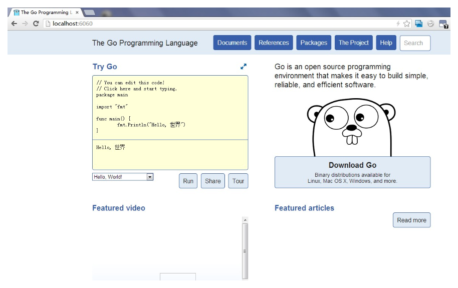
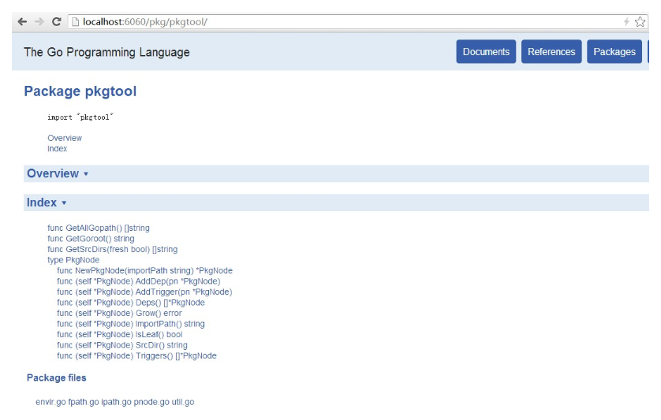

### 0.5 go doc和godoc

 **go doc**

```go doc```命令其实是使用```godoc```命令提取和生成指定代码包的文档的。```go doc```命令做的只是为```godoc```命令检查和设置正确的代码包路径，以及在其上追加几个额外的可用标记。```go doc```命令的可用标记如下表。

_表0-5 ```go doc```命令的标记说明_
<table class="table table-bordered table-striped table-condensed">
   <tr>
    <th width=25%>
	  标记名称
	</th>
    <th>
	  标记描述
	</th>
  </tr>
  <tr>
    <td>
	  -n
	</td>
	<td>
	  打印所用的命令，但是并不真正执行。
	</td>
  </tr>
  <tr>
    <td>
	  -x
	</td>
	<td>
	  打印所用的命令。
	</td>
  </tr>
</table>

这两个标记的含义非常简单，而且它们在其它命令中也都是有效的。

```go doc```命令在执行时会首先在检查和设置代码包导入路径。然后将代码包导入路径作为参数传递给```godoc```命令。

    hc@ubt:~/golang/goc2p$ go doc -n  logging 
    godoc logging

如果我们用本地代码包路径提供代码包位置，那么```go doc```命令会首先把它转换为标准的代码包导入路径，并传递给```godoc```命令。现在我们用代码包的目录相对路径作为命令参数：

	hc@ubt:~/golang/goc2p$ go doc -n  ./src/logging 
	godoc logging
	
我们看到，这里在执行```godoc```命令时同样是以logging作为参数的。

**godoc**

命令```godoc```是一个很强大的工具。它有两种模式可供选择。

如果在执行命令时不加入```-http```标记，则该命令就以命令行模式运行。在打印纯文本格式的文档到标准输出后，命令执行就结束了。比如，我们用命令行模式查看代码包fmt的文档：

	hc@ubt:~$ godoc fmt
	
由于篇幅原因，我们在本小节中略去了文档查询结果。读者可以自己运行一下上述命令。在该命令被执行之后，我们就可以看到编排整齐有序的文档内容了。这包括代码包```fmt```的综述和所有可导出成员的声明、文档以及例子。

有时候我们只是想查看某一个函数或者结构体类型的文档，那么我们可以将这个函数或者结构体的名称加入命令的最后面，像这样：

	hc@ubt:~$ godoc fmt Printf
	
或者：

	hc@ubt:~$ godoc os File
	
如果我们想同时查看一个代码包中的几个函数的文档，则仅需将函数或者结构体名称追加到命令后面。比如我们要查看代码包```fmt```中函数```Printf```和函数```Println```的文档：

	hc@ubt:~$ godoc fmt Printf Println
	
如果我们不但想在文档中查看可导出成员的声明，还想看到它们的源码，那么我们可以在执行```godoc```命令的时候加入标记```-src```，比如这样：

	hc@ubt:~$ godoc -src fmt Printf
	
Go语言为程序使用示例代码设立了专有的规则。我们在这里暂不讨论这个规则的细节。只需要知道正因为有了这个专有规则，使得```godoc```命令可以根据这些规则提取相应的示例代码并把它们加入到对应的文档中。如果我们想在查看代码包```net```中的结构体```Listener```的文档的同时查看关于它的示例代码，那么我们只需要在执行命令时加入标记```-ex```。使用方法如下：

	hc@ubt:~$ godoc -ex net Listener
	
在实际的Go语言环境中，我们可能会遇到一个命令源码文件所产生的可执行文件与代码包重名的情况。比如本节介绍的命令```go```和官方代码包```go```。现在我们要明确的告诉```godoc```命令要查看可执行文件go的文档，我们需要在名称前加入“cmd/”前缀：

	hc@ubt:~$ godoc cmd/go
	
另外，如果我们想查看HTML格式的文档，就需要加入标记```-html```。当然，这样在命令行模式下的查看效果是很差的。但是，如果仔细查看的话，可以在其中找到一些相应源码的链接地址。

一般情况下，```godoc```命令会去Go语言根目录和环境变量GOPATH的值（一个或多个工作区）指向的工作区目录中查找代码包。不过，我们还可以通过加入标记```-goroot```来制定一个Go语言根目录。这个被指定的Go语言根目录仅被用于当次命令的执行。示例如下：

	hc@ubt:~$ godoc -goroot="/usr/local/go" fmt

现在让我们来看看另外一种模式。如果我们在执行命令时加上```-http```标记则会启用另一模式。这种模式被叫做Web服务器模式，它以Web页面的形式提供Go语言文档。

我们使用如下命令启动这个文档Web服务器：

	hc@ubt:~/golang/goc2p$ godoc -http=:6060
	
标记```-http```的值```:6060```表示启动的Web服务器使用本机的6060端口。之后，我们就可以通过在网络浏览器的地址栏中输入```http://localhost:6060```来查看以网页方式展现的Go文档了。



_图0-1 本机的Go文档Web服务首页_

这与Go语言官方站点（```http://golang.org```）的Web服务页面如出一辙。这使得我们在不方便访问Go语言官方站点的情况下也可以查看Go语言文档。并且，更便利的是，通过本机的Go文档Web服务，我们还可以查看所有本机工作区下的代码的文档。比如，goc2p项目中的代码包```pkgtool```的页面如下图：



_图0-2 goc2p项目中的pkgtool包的Go文档页面_

现在，我们在本机开启Go文档Web服务器，端口为9090。命令如下:

	hc@ubt:~$ godoc -http=:9090 -index
	
注意，要使用```-index```标记开启搜索索引，这个索引会在服务器启动时创建并维护。否则无论在Web页面还是命令行终端中提交查询都会返回错误“Search index disabled: no results available”。

索引中提供了标示符和全文本搜索信息（通过正则表达式为可搜索性提供支持）。全文本搜索结果显示条目的最大数量可以通过标记```-maxresults```提供。标记```-maxresults```默认值是10000。如果不想提供如此多的结果条目，可以设置小一些的值。甚至，如果不想提供全文本搜索结果，可以将标记```-maxresults```的值设置为0，这样服务器就只会创建标识符索引，而根本不会创建全文本搜索索引了。标识符索引即为对程序实体（变量、常量、函数、结构体和接口）名称的索引。

正因为在使用了```-index```标记的情况下文档服务器会在启动时创建索引，所以在文档服务器启动之后还不能立即提供搜索服务，需要稍等片刻。在索引为被创建完毕之前，我们的搜索操作都会得到提示信息“Indexing in progress: result may be inaccurate”。

如果我们在本机用```godoc```命令启动了Go文档Web服务器，且IP地址为192.168.1.4、端口为9090，那么我们就可以在另一个命令行终端甚至另一台能够与本机联通的计算机中通过如下命令进行查询了。查询命令如下：

	hc@ubt:~$ godoc -q -server="192.168.1.4:9090" Listener
	
命令的最后为要查询的内容，可以是任何你想搜索的字符串，而不仅限于代码包、函数或者结构体的名称。

标记```-q```开启了远程查询的功能。而标记```-server="192.168.1.4:9090"```则指明了远程文档服务器的IP地址和端口号。实际上，如果不指明远程查询服务器的地址，那么该命令会自行将地址“:6060”和“golang.org”作为远程查询服务器的地址。这两个地址即是默认的本机文档Web站点地址和官方的文档Web站点地址。所以执行如下命令我们也可以查询到标准库的信息：

	hc@ubt:~$ godoc -q=true fmt
	
命令```godoc```还有很多可用的标记，但在通常情况下并不常用。读者如果有兴趣，可以在命令行环境下执行```godoc```进行查看。

至于怎样才能写出优秀的代码包文档，我们会在本章的第三节中详细说明。


## links  
  * [目录](catalog.md)
  * 上一节: [go clean](0.4.md)
  * 下一节: [go run](0.6.md)